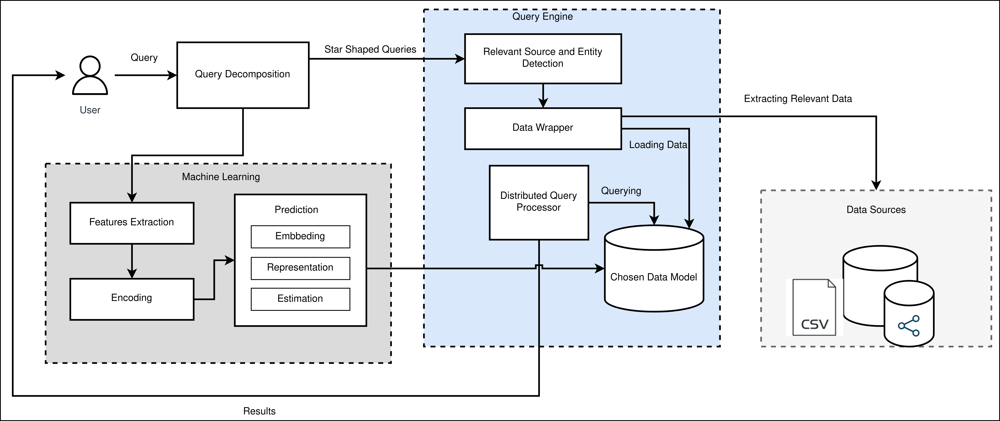

[](https://gitter.im/OPTIMA)


# OPTIMA: Optimal Virtual Data Model for Querying Large Heterogeneous Data
OPTIMA is an Ontology-Based Big Data Access (Smeantic Data Lakes) that supports two types of virtual data model GRAPH and TABULAR and predicts the optimal one based on the SPARQL query behavior using deep learning algorithm.

Currently OPTIMA integrates:
- Two different virtual data models, GRAPH and TABULAR, to join and aggregate data.
- Deep learning method to select automatically the optimal virtual model based on query.
- State-of-the-art Big Data engines Apache Spark and Spark Graphx and supports out-of-the-box five data sources Neo4j, MongoDB, MySQL, Cassandra and CSV.

## Usage (Live Demo)

We provide a [live demo version](http:/) of OPTIMA, which can be used to try our software without registration.
Additionally, [this short video](docs/optima-demo.mp4) shows an example of a query execution in case the predicted optimal virtual data model is GRAPH.


To enable the reproducibility of OPTIMA, we refer first to the baiscs on the following  Wiki page: [OPTIMA Basics](https://github.com/). which also helps understand the installation steps hereafter.

## Architecture Overview

OPTIMA' virtual data model prediction component selects the optimal virtual data model GRAPH or TABULAR based on the query behavior. 
The rest of the OBDA components make use of the selected virtual data model GRAPH or TABULAR for querying.



## Getting Started
__Local setup:__
*- Prerequisite:* 

1. Clone the repository


### Spark Graphx
- Download Spark GraphX API (https://spark.apache.org/docs/latest/graphx-programming-guide.html) from the [Spark official website](https://spark.apache.org/...). In order for Spark to run in a cluster, you need to configure a 'standalone cluster' following guidelines in the [official documentation page](https://spark.apache.org/docs/2.2.0/spark-standalone.html).

- #### Example:


  **- Note:** If any error raised due to 

### Spark
- Download Spark from the [Spark official website](https://spark.apache.org/downloads.html). In order for Spark to run in a cluster, you need to configure a 'standalone cluster' following guidelines in the [official documentation page](https://spark.apache.org/docs/2.2.0/spark-standalone.html).

- Once Spark is installed, navigate to `bin` folder and run `spark-submit` 

- #### Example:


__DISCLAIMER:__
The steps above are valid to run in Ubuntu 20.04.4 LTS


__Major Versions:__
- Scala 2.11
- Graphx 2.3.4
- Spark 2.3.4

__Troubleshooting:__
- check if node version compatibility for front and api then 

## Technical Workflow
After starting OPTIMA, you can test it by using one of the queries available in [queries repo](evaluation/queries).

### Example
```
PREFIX rdfs: <http://www.w3.org/2000/01/rdf-schema#>
PREFIX rdf: <http://www.w3.org/1999/02/22-rdf-syntax-ns#>
PREFIX bsbm: <http://www4.wiwiss.fu-berlin.de/bizer/bsbm/v01/vocabulary/>

SELECT  DISTINCT ?label ?comment ?propertyNum1 ?product
WHERE {
	?product rdfs:label ?label .
	?product rdfs:comment ?comment .
	?product bsbm:productPropertyNumeric1 ?propertyNum1 .
	?product rdf:type bsbm:Product .
	FILTER (?label = "ahchoo") .
	FILTER (?propertyNum1 <= 1000) .
}
```

## Evaluation
To test OPTIMA you can use the input files and queries available in [evaluation repo](evaluation).

## Extensibility
OPTIMA can be extented by adding new connectors. For example to connect to parquet database use the parquet connector as follows:

#### For TABULAR
``` spark.read.options(options).parquet(sourcePath)```
#### For GRAPH
``` sqlContext.read.(sourcePath).rdd ```
## Publications
- 

## How to cite
We are currently preparing a scientific paper for a peer-reviewed publication. Please refer to [references.bib](references.bib) for BibTex references, which we will update continuously.

## Contact
For any setup difficulties or other inquiries, please contact , or ask directly on [Gitter chat](https://gitter.im/).

*Not only for issues, but also for successes, let us know either way :)*

License
-------

This project is openly shared under the terms of the __Apache License
v2.0__ ([read for more](./LICENSE)).


